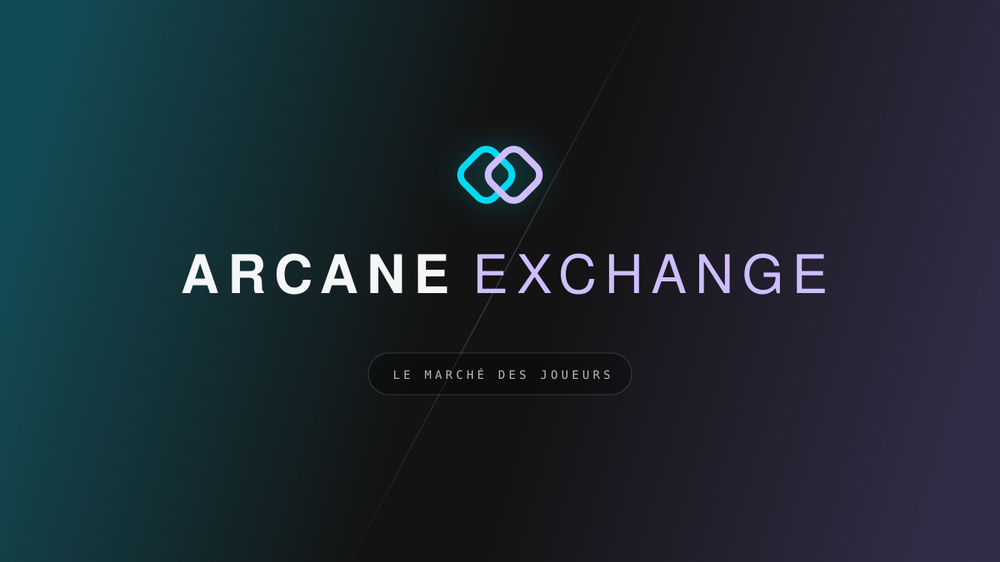

[](https://codecov.io/gh/michaelcoll/arcane-exchange)
[](LICENSE)

Track what your Magic: The Gathering collection is worth, find the cards you're missing in other players'
collections, and trade them — card for card.

## Features

- **Your collection, valued** — import a Manabox export and see the total value, the 30-day trend and a price history
  for every card.
- **Real market prices** — daily prices from Cardmarket, card data from Scryfall, playability signals from EDHREC.
- **Find who owns a card** — search by card name, by decklist, or browse a specific player's collection.
- **Trade in two clicks** — request a card, get a counter-offer, negotiate. The app computes the value difference; the
  cash delta is settled between players, off-platform.

**Stack** — Rust (Axum, SQLx) · Nuxt 4 / Vue 3 / Tailwind · PostgreSQL 18 · Clerk for authentication.

## Quick start (Docker Compose)

```bash
cp .env.example .env   # then fill in your Clerk keys
docker compose up -d
```

- App: <http://localhost:9797>
- API: <http://localhost:8080>

## Development

Install [`mise`](https://mise.jdx.dev/) — it provides Node, pnpm and the Rust CLI tools. You also need a stable **Rust**
toolchain (edition 2024) and a **PostgreSQL 18** instance.

```bash
mise install                    # toolchain
mise run setup                  # install dependencies
docker compose up -d postgres   # or use your own PostgreSQL
mise run migrate                # apply database migrations

mise run back                   # API on http://localhost:8080
mise run front                  # app on http://localhost:3000
```

Before opening a PR, run `mise run checks` (OpenAPI, tests, lint) and `mise run format`.
`mise tasks` lists everything else.

## Configuration

Copy `.env.example` to `.env` and fill it in — the Clerk keys are the only values you must provide to run the app.
Everything else (database URL, ports, external API endpoints) has a working default in `mise.toml` for local
development, and in `docker-compose.yml` for Compose.

Authentication is handled by [Clerk](https://clerk.com/): create an instance, then set `CLERK_FRONTEND_API_URL`
(used by the backend to validate JWTs) along with the publishable and secret keys used by the frontend.

## Contributing

- The HTTP API is documented in [`doc/openapi.yml`](doc/openapi.yml) — regenerate it with `mise run openapi`.
- Feature specs live in [`doc/specs/`](doc/specs).
- Conventions, architecture notes and the full task list are in [`AGENTS.md`](AGENTS.md) and `.agents/`.

## License

[MIT](LICENSE) © Michaël COLL
