# postgres — public schema

```mermaid
erDiagram
    card {
        character_varying(5) set_code PK, FK
        character_varying(10) collector_number PK
        character_varying(2) language_code PK
        boolean foil PK
        character_varying(255) name "not null"
        character_varying(1) rarity "not null"
        uuid scryfall_id "not null"
        integer cardmarket_id
        character_varying(64) the_gatherer_id
    }
    cardmarket_price {
        integer id_produit PK
        date date PK
        integer low
        integer trend
        integer avg
        integer low_foil
        integer trend_foil
        integer avg_foil
    }
    collection_entry {
        character_varying(5) set_code FK "not null"
        character_varying(10) collector_number FK "not null"
        character_varying(2) language_code FK "not null"
        boolean foil FK "not null"
        character_varying(50) user_id FK "not null"
        integer quantity "not null"
        integer purchase_price "not null"
        timestamp_with_time_zone added_at
        character_varying(255) binder_name
    }
    collection_price_history {
        date date PK
        character_varying(50) user_id PK
        integer low "not null"
        integer trend "not null"
        integer avg "not null"
    }
    collection_rarity_filters {
        character_varying(50) user_id PK, FK
        character_varying(1) rarity PK
        boolean is_open "not null, default: false"
        smallint kept_copies "not null, default: 0"
    }
    mv_card_prices {
        character_varying(5) set_code
        character_varying(10) collector_number
        character_varying(2) language_code
        boolean foil
        character_varying(255) name
        character_varying(1) rarity
        uuid scryfall_id
        character_varying(64) the_gatherer_id
        character_varying(50) user_id
        integer quantity
        integer purchase_price
        timestamp_with_time_zone added_at
        integer low
        integer trend
        integer avg
    }
    mv_last_cardmarket_prices {
        character_varying(5) set_code
        character_varying(10) collector_number
        boolean foil
        integer low
        integer trend
        integer avg
    }
    set_name {
        character_varying(5) set_code PK
        character_varying(255) name "not null"
    }
    trade {
        uuid id PK
        character_varying(50) initiator_user_id FK "not null"
        character_varying(50) respondent_user_id FK "not null"
        character_varying(20) status "not null"
        integer initiator_amount_due
        integer respondent_amount_due
        timestamp_with_time_zone created_at "not null, default: now()"
        timestamp_with_time_zone updated_at "not null, default: now()"
        timestamp_with_time_zone initiator_accepted_at
        timestamp_with_time_zone respondent_accepted_at
        timestamp_with_time_zone initiator_confirmed_at
        timestamp_with_time_zone respondent_confirmed_at
        smallint initiator_rating
        smallint respondent_rating
    }
    trade_card {
        uuid trade_id PK, FK
        character_varying(5) set_code PK, FK
        character_varying(10) collector_number PK, FK
        character_varying(2) language_code PK, FK
        boolean foil PK, FK
        character_varying(50) owner_user_id PK, FK
        integer quantity "not null"
    }
    trading_binders {
        character_varying(50) user_id PK, FK
        character_varying(255) binder_name PK
    }
    users {
        character_varying(50) id PK
        character_varying(100) username UK "not null"
        character_varying(10) visibility "not null, default: 'private'::character varying"
        text image_url
    }
    v_tradable_entry {
        character_varying(50) user_id
        character_varying(5) set_code
        character_varying(10) collector_number
        character_varying(2) language_code
        boolean foil
        integer proposed_quantity
    }
    set_name ||--o{ card : "set_code"
    card ||--o{ collection_entry : "set_code, collector_number, language_code, foil"
    users ||--o{ collection_entry : "user_id"
    users ||--o{ collection_rarity_filters : "user_id"
    users ||--o{ trade : "initiator_user_id"
    users ||--o{ trade : "respondent_user_id"
    card ||--o{ trade_card : "set_code, collector_number, language_code, foil"
    users ||--o{ trade_card : "owner_user_id"
    trade ||--o{ trade_card : "trade_id"
    users ||--o{ trading_binders : "user_id"
```

## Views

- `mv_card_prices` (materialized view)
- `mv_last_cardmarket_prices` (materialized view)
- `v_tradable_entry` (view)

## Indexes and constraints

### collection_entry

- unique index `collection_entry_uk` (`set_code`, `collector_number`, `language_code`, `foil`, `user_id`, `binder_name`)
- unique constraint `collection_entry_uk` (`set_code`, `collector_number`, `language_code`, `foil`, `user_id`, `binder_name`)

### collection_rarity_filters

- check constraint `collection_rarity_filters_kept_copies_check`: `CHECK (((kept_copies >= 0) AND (kept_copies <= 4)))`
- check constraint `collection_rarity_filters_rarity_check`: `CHECK (((rarity)::text = ANY ((ARRAY['C'::character varying, 'U'::character varying, 'R'::character varying, 'M'::character varying, 'S'::character varying])::text[])))`

### mv_card_prices

- index `idx_mv_card_prices_name_trgm` (`name`)
- unique index `mv_card_prices_unique` (`set_code`, `collector_number`, `language_code`, `foil`, `user_id`)

### mv_last_cardmarket_prices

- unique index `mv_last_cardmarket_prices_unique` (`set_code`, `collector_number`, `foil`)

### trade

- check constraint `trade_initiator_rating_check`: `CHECK (((initiator_rating >= 0) AND (initiator_rating <= 5)))`
- check constraint `trade_respondent_rating_check`: `CHECK (((respondent_rating >= 0) AND (respondent_rating <= 5)))`

### trade_card

- index `trade_card_card_owner_idx` (`set_code`, `collector_number`, `language_code`, `foil`, `owner_user_id`)

### users

- index `idx_users_username_trgm` (expression)
- unique index `users_username_unique` (`username`)
- unique constraint `users_username_unique` (`username`)
- check constraint `users_visibility_check`: `CHECK (((visibility)::text = ANY ((ARRAY['public'::character varying, 'trade'::character varying, 'private'::character varying])::text[])))`
